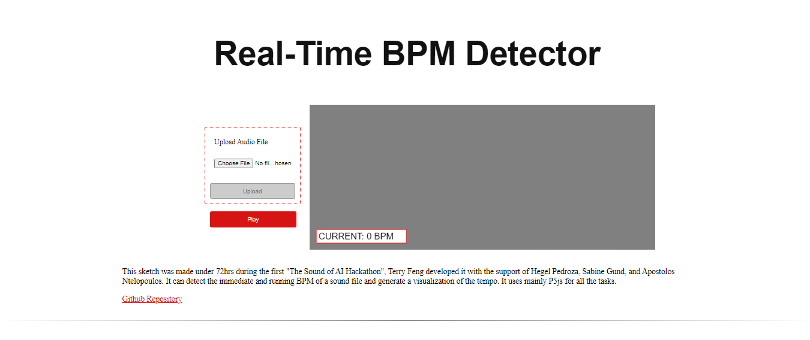

# Real-Time BPM Detector

This is a P5js web application that uses peak detection to determine BPM of songs in real time. 

Check out the demo: [https://realtimebpm.netlify.app/](https://realtimebpm.netlify.app/)

## Development

1. Clone the repository
2. Run `index.html` using a live server (VSCode, p5)

## Contributors 

Terry Feng

Hegel Pedroza

Sabine Gund

Apostolos Ntelopoulos
